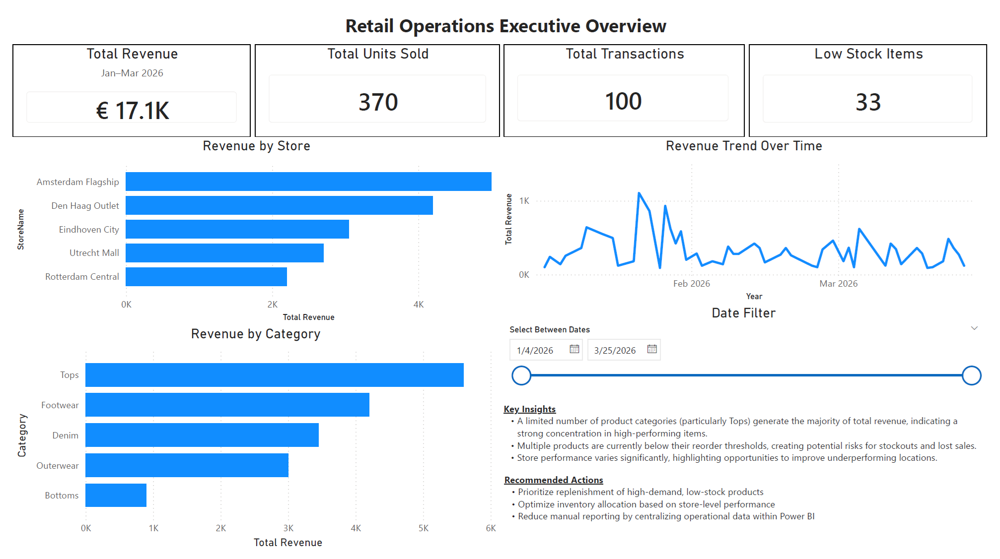
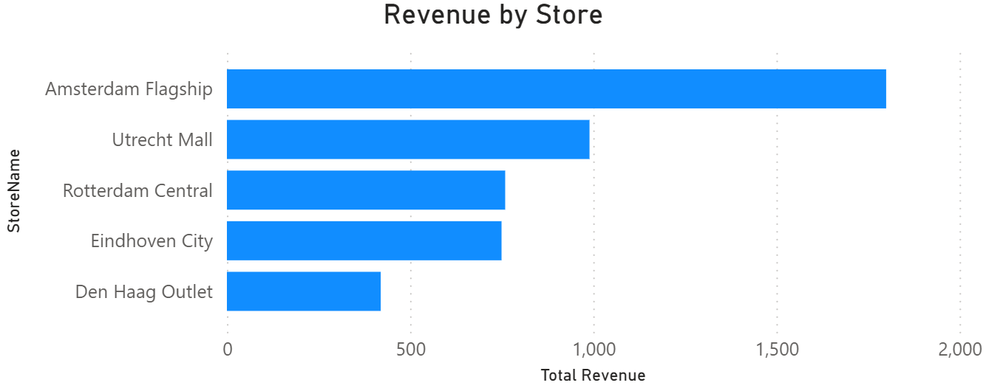
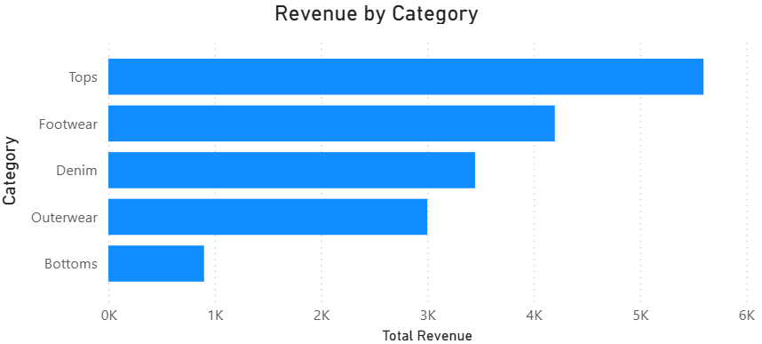
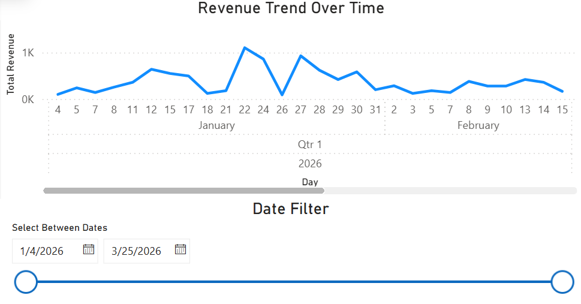
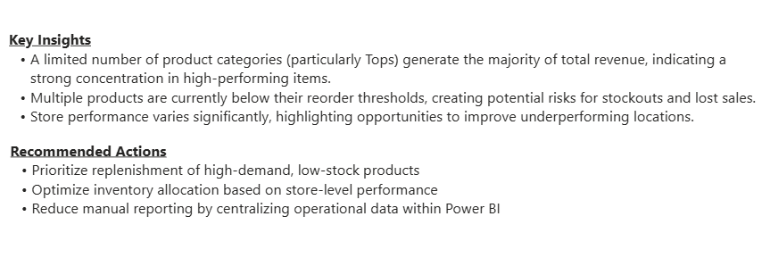

# Retail Operations Power BI Dashboard

## Live Dashboard
[View Interactive Dashboard](https://app.powerbi.com/view?r=eyJrIjoiMDExM2E4M2UtMzM3Mi00NmExLWI1ODUtOTk1OGIwMmJlZWNmIiwidCI6Ijg5ODJiNGEyLThmMTMtNDFjZS04NzllLTU2NmViZWI0ODFkMSIsImMiOjl9)

---

## Overview
End-to-end Business Intelligence project focused on improving retail operations visibility by centralising sales, inventory, and store performance data.

This dashboard replaces fragmented manual reporting with a structured, scalable solution that supports faster and more informed decision-making.

---

## Dashboard Preview

---

## Business Problem
Retail operations lacked a centralised reporting structure, resulting in:
- Limited visibility into sales and inventory performance
- Inefficient decision-making
- Manual and time-consuming reporting processes

---

## Solution
Developed an interactive Power BI dashboard that:
- Consolidates sales, inventory, and store data
- Tracks key operational KPIs
- Enables dynamic filtering and performance analysis

---

## Key Features
- KPI tracking (Revenue, Units Sold, Transactions, Low Stock)
- Revenue analysis by store and category
- Time-based trend analysis
- Interactive date filtering
- Identification of inventory risks

---

## Analysis & Insights

### Revenue Performance

### Trends Over Time

### Key Insights & Recommendations

---

## Key Insights
- Revenue is concentrated in a limited number of product categories
- Several products fall below reorder thresholds, creating stock risk
- Store performance varies significantly across locations

---

## Recommendations
- Prioritise replenishment of high-demand, low-stock products
- Optimise inventory allocation based on performance
- Replace manual reporting with centralised dashboards

---

## Tools Used
- Power BI
- Excel
- Data Modelling
- KPI Design

---

## Repository Structure
- `/data` → dataset used
- `/dashboard` → Power BI file
- `/screenshots` → dashboard visuals
- `/docs` → business case documentation
